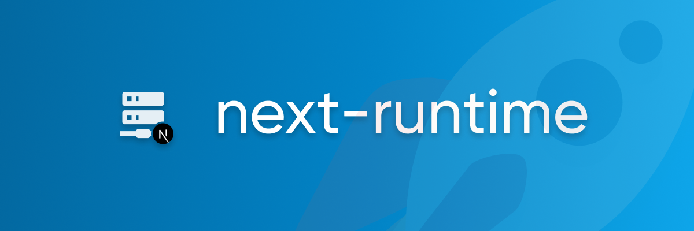

All you need to handle `POST` requests and file uploads in [`getServerSideProps`](https://nextjs.org/docs/basic-features/data-fetching#getserversideprops-server-side-rendering).

## Documentation

All documentation and guides can be found at [next-runtime.meijer.ws](https://next-runtime.meijer.ws/).

## Features

next-runtime aims to move more logic to the "runtime part" of your Next.js server, and less static site generation. With proper cache headers, every server is an (incremental) static site generator.

To achieve that, we provide you a convenient API to:

- Handle POST requests in `getServerSideProps`.
- Handle file uploads in `getServerSideProps`.
- Easily manage headers and cookies.
- Reuse `getServerSideProps` as zero-config JSON api.

## Usage

In case you're not the documentation type of person, here's a quick example to get you up and running. Please consult [the docs](https://next-runtime.meijer.ws/) if this leaves you with questions.

```js
import fs from 'fs';
import { handle, json } from 'next-runtime';

export const getServerSideProps = handle({
  async upload({ file, stream }) {
    stream.pipe(fs.createWriteStream(`/uploads/${file.name}`));
  },

  async get({ params, query }) {
    return json({ name: 'Stephan Meijer' });
  },

  async post({ req: { body } }) {
    return json({ message: 'Thanks for your submission!' });
  },
});

export default function Home({ name, message }) {
  if (message) {
    return <p>{message}</p>;
  }

  return (
    <form method="post" encType="multipart/form-data">
      <input name="name" defaultValue={name} />
      <input type="file" name="file" />
      <button type="submit">submit</button>
    </form>
  );
}
```

## Sponsor

Are you, or your employer, a satisfied user of this, or any of [my other projects](https://meijer.ws/open-source). Then please [consider sponsoring](https://github.com/sponsors/smeijer) my work so I can dedicate more time to maintaining this kind of projects.

## Contributing

Please check [contributing.md](/CONTRIBUTING.md). It contains info about the structure of this repo
to help you get up and running.

## Contributors

Thanks goes to these wonderful people ([emoji key](https://allcontributors.org/docs/en/emoji-key)):

<!-- ALL-CONTRIBUTORS-LIST:START - Do not remove or modify this section -->
<!-- prettier-ignore-start -->
<!-- markdownlint-disable -->
<table>
  <tr>
    <td align="center"><a href="https://github.com/smeijer"><br /><sub><b>Stephan Meijer</b></sub></a><br /><a href="https://github.com/smeijer/next-runtime/commits?author=smeijer" title="Code">💻</a> <a href="https://github.com/smeijer/next-runtime/commits?author=smeijer" title="Documentation">📖</a> <a href="#ideas-smeijer" title="Ideas, Planning, & Feedback">🤔</a> <a href="#infra-smeijer" title="Infrastructure (Hosting, Build-Tools, etc)">🚇</a> <a href="#maintenance-smeijer" title="Maintenance">🚧</a></td>
    <td align="center"><a href="https://gal.hagever.com"><br /><sub><b>Gal Schlezinger</b></sub></a><br /><a href="https://github.com/smeijer/next-runtime/commits?author=schniz" title="Documentation">📖</a></td>
    <td align="center"><a href="http://mapleleaf.dev"><br /><sub><b>Darius</b></sub></a><br /><a href="https://github.com/smeijer/next-runtime/commits?author=itsMapleLeaf" title="Code">💻</a> <a href="https://github.com/smeijer/next-runtime/commits?author=itsMapleLeaf" title="Tests">⚠️</a></td>
    <td align="center"><a href="http://umarahmed.dev"><br /><sub><b>Umar Ahmed</b></sub></a><br /><a href="https://github.com/smeijer/next-runtime/commits?author=umar-ahmed" title="Code">💻</a></td>
    <td align="center"><a href="http://www.a-tm.co.jp/"><br /><sub><b>HIKARU KOBORI</b></sub></a><br /><a href="https://github.com/smeijer/next-runtime/commits?author=anneau" title="Code">💻</a></td>
    <td align="center"><a href="https://github.com/KoichiKiyokawa"><br /><sub><b>Koichi Kiyokawa</b></sub></a><br /><a href="https://github.com/smeijer/next-runtime/commits?author=KoichiKiyokawa" title="Code">💻</a> <a href="https://github.com/smeijer/next-runtime/commits?author=KoichiKiyokawa" title="Tests">⚠️</a></td>
  </tr>
</table>

<!-- markdownlint-restore -->
<!-- prettier-ignore-end -->

<!-- ALL-CONTRIBUTORS-LIST:END -->

This project follows the [all-contributors](https://github.com/all-contributors/all-contributors) specification. Contributions of any kind welcome!
